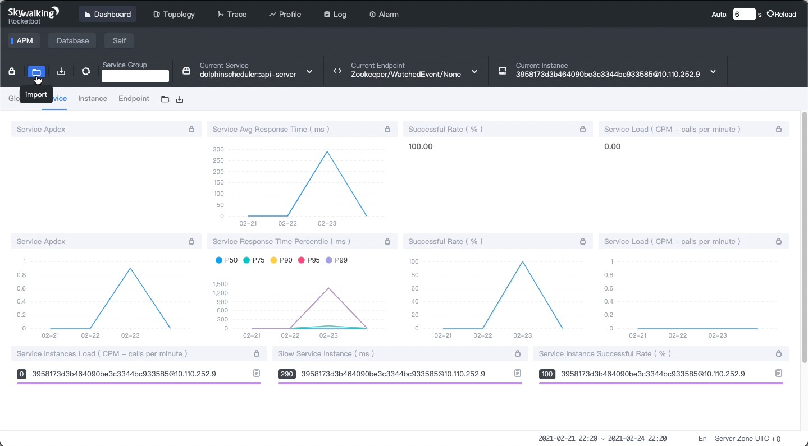
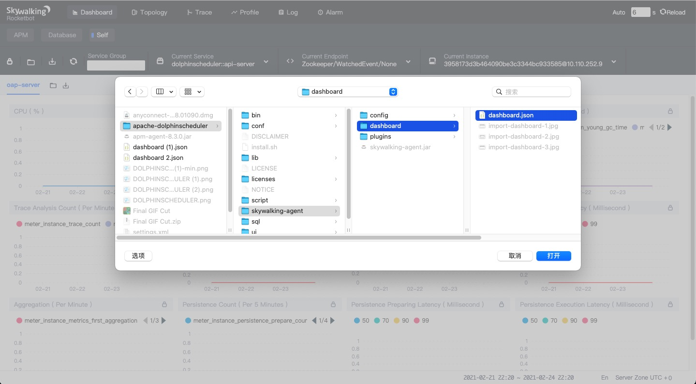
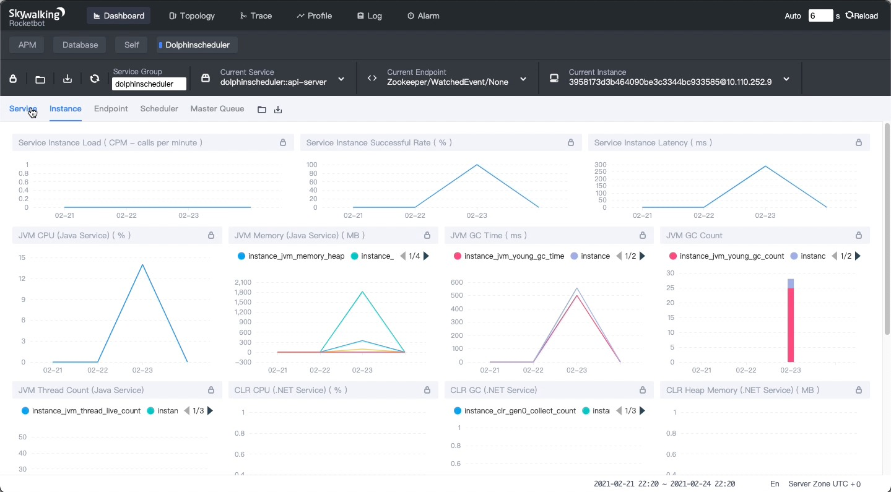

dolphinscheduler-skywalking
=============================

The dolphinscheduler-skywalking module provides skywalking monitor agent for the dolphinscheduler project.

This document describes how to enable skywalking support with this module.

# Installation

The following configuration is used to enable skywalking agent.

Please make sure the skywalking oap-server is started.

### Through environment variable configuration (for Docker)

```shell

docker run -d --name dolphinscheduler \
    -e SKYWALKING_ENABLE=true \
    -e SW_AGENT_COLLECTOR_BACKEND_SERVICES="your.skywalking-oap-server.com:11800" \
    ...
    apache/dolphinscheduler:latest all

```

### Through install_config.conf configuration (for dolphinscheduler install.sh)

Add the following configurations to `${workDir}/conf/config/install_config.conf`.

```properties

# skywalking config
# note: enable skywalking tracking plugin
enableSkywalking="true"
# note: configure skywalking backend service address
skywalkingServers="your.skywalking-oap-server.com:11800"

```

# Usage

### Import dashboard

Import dolphinscheduler dashboard to skywalking.





